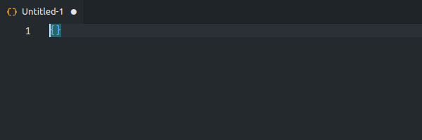
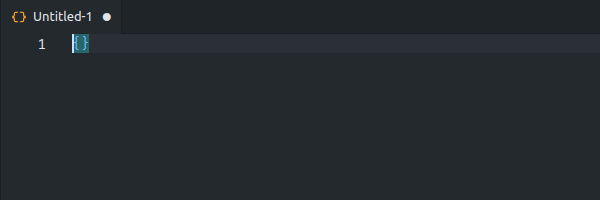

# Brazilian Doc Gen

Brazilian Doc Gen is a robust extension designed to generate valid information for various Brazilian documents. This tool streamlines the creation of commonly used Brazilian document numbers, saving developers and testers both time and effort.

Key Features:

- Simplified generation of valid Brazilian document numbers.
- Easy access to commands through `Ctrl+Shift+J` or `right-click menu`.
- Alternative command selection with `Ctrl+Shift+P`.

With Brazilian Doc Gen, efficiently manage your document generation tasks with ease and accuracy.

## Features

- **Generate CPF**: Generate valid CPF numbers.

  
- **Generate CNPJ**: Generate valid CNPJ numbers.

  

## Release Notes

### Version 1.0.0

The first version of the Brazilian Doc Gen extension includes the following functionalities:

- [✓] Generate CPF
- [✓] Generate CNPJ

## Future Features

The following features are planned for future releases:

- [ ] Generate CEP
- [ ] Generate CNH
- [ ] Generate Bank Account
- [ ] Generate NickName
- [ ] Generate PIS/PASEP
- [ ] Generate RENAVAM
- [ ] Generate Vehicle Plate
- [ ] Generate RG
- [ ] Generate Voter ID
- [ ] Generate Credit Card
- [ ] Generate Lorem Ipsum Text
- [ ] Generate Password
- [ ] Generate Wage

### Stay tuned for updates!

***Enjoy using Brazilian Doc Gen!***
